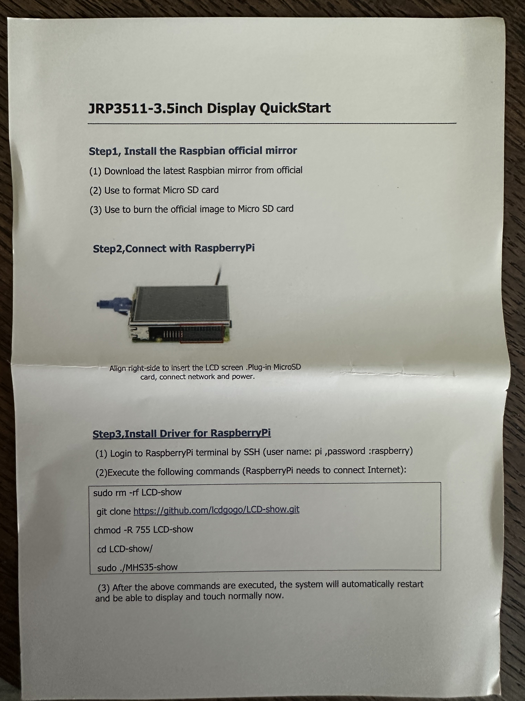

# Notes on building the book

## What did I buy 
* Raspberry Pi 5 (specs)
* Screen (specs)
    * including active cooler 
* USB C <-> USB C cable
* USB A -> 3.5 mm jack
* 32 GB micro SD
* Solar panel
* Solar power manager
* Three rechargeable batteries


## Setup
Mount Pi platform in case (4 screws)
Mount active cooler on Pi platform (two push thru click connectors, power connector, and three adhesive tape pieces)
Mount active v
Raspberry Pi imager 1.9.6
Raspberry Pi OS (64-bit) -> Micro SD


## Software setup
* With the Imager onze needs to point to a network, I used my home network. In the case this thing is stored elsewhere that is not going to work. Should we include instructions on how it is setup and how to connect.
* Enable SHH: admin/pass (allow login/pass authentication)
* What about longevity of the SD itself?

* Attach display, then:

```
sudo rm -rf LCD-show
git clone https://github.com/goodtft/LCD-show.git
chmod -R 755 LCD-show
cd LCD-show/
sudo ./LCD35-show
```

This is slightly different from the packed instructions 


## No GUI, no GUI
https://wiki.52pi.com/index.php?title=KZ-0060

<a href="./notes-resources/52pi(manufacturer)instructions.png">manufacturer instructions (local file: ./notes-resources/52pi(manufacturer)instructions.png)</a>

download etcher (https://etcher.balena.io/#download-etcher) 
and image (https://mega.nz/folder/6uR0SYLS#t4DJRQLX6F-Uv-i7jCaCKQ)
etch image
starts flawlessly
but hmm.. precompiled distro. no idea what is contains. not nice


# 20260724

## Updating
Updating within the provided distro does succeed, and the display keeps working.

## Rotating screen
You can use the CMD key to open the start menu, down to "Accessories", then "Terminal"

```
sudo nano /boot/config.txt
```

Find the line reading `dtoverlay=mhs35`, change it to:

```
dtoverlay=mhs35:rotate=0
```

(0: portrait, 90: landscape, 180: inverted portrait, 270: inverted landscape.)

You also have to make sure that the touchscreen follows your setting. For `rotate=0`:

```
sudo nano /etc/X11/xorg.conf.d/99-calibration.conf
```

Make sure the section Input Class has the following (next to what might already be there):

```
Section "InputClass"
        Identifier "calibration"
        MatchProduct "ADS7846 Touchscreen"
        Option "SwapAxes" "0"
        Option "TransformationMatrix" "-1 0 1 0 1 0 0 0 1"
EndSection
```

I only needed to set Swap Axes to 0 and add that TransformationMatrix.


## Solving the rediculous 1m30s startup time
For reasons unknown to me the boot process waits for two services to finish (and allows a time out of 1m30s for this). If this happens you can confirm this on boot by pressing the down key on the splash screen if this is not disabled. In that case you'll see three jobs waiting and waiting and waiting.

The culprits are
```
dev-dri-card0.device
dev-dri-renderD128.device
```

dev-dri-card0.device is a systemd unit that manages the Direct Rendering Manager (DRM) hardware for graphics. It represents the primary 3D rendering core or video card used by the Linux kernel to run user interfaces, desktop environments, and hardware-accelerated graphics.

/dev/dri/renderD128 is a Direct Rendering Manager (DRM) render node used for hardware-accelerated 3D graphics, video decoding, and encoding without needing a display server or root permissions. On a Raspberry Pi, it provides headless access to the VideoCore GPU for applications like web browsers, media centers, and transcoding servers.

But on this system we are using an ultra slow hat attached 3.5 inch touch screen device. We can easily skip these accelerators. If you ever *do* want GPU/DRM acceleration (e.g., for hardware-accelerated rendering even on the small screen, or if you later attach an HDMI display), masking these could cause problems since the devices genuinely won't be usable/recognized properly by systemd. Given you're on a dedicated SPI-hat-only setup, this is probably fine. To do so:

```
sudo systemctl mask dev-dri-renderD128.device
sudo systemctl mask dev-dri-card0.device
```

After this: super fast GUI start.

To undo this if needed:

```
sudo systemctl unmask dev-dri-card0.device
sudo systemctl unmask dev-dri-renderD128.device
```


## Turing it into an AP (Access Point for connecting to it as Wifi and browsing to the editions)

I fought the Pi and Claude for a long time trying to run `hostapd` to create an access point. This absolutely didn't work. Whenever a client connected sudo would no work anymore (wouldn't return in terminal). Claude even had me install core dump lib to generate core dumps etc. But it seemed at that point to me that the hole only could get deeper. So, I asked Gemini, which suggested:

```
sudo nmcli device wifi hotspot ssid "QUEDEEWifi" password "quedee1.0" ifname wlan0
```

This works wonderfully, but it does not persist across boots. That's the next todo.

```
nmcli connection show
```

This will allow you to identify which id the Pi gave to the AP connection on the wifi. It is usually called 'Hotspot'. Then to persist:

```
sudo nmcli connection modify Hotspot connection.autoconnect yes
```

Tip: to get more information specifically on your AP connection: `nmcli connection show Hotspot` (or the name you found for the connection).

The AP should now persist across reboots.


## Running a website in kiosk mode

1. Enable auto-login to desktop. (Probalby is already set!)

```
sudo raspi-config
```

Then: raspi-config: 2 Display Options → D4 Screen Blanking → No.


2. Create an autostart entry

```
mkdir -p ~/.config/autostart
nano ~/.config/autostart/kiosk.desktop
```

Make the contents of that file the following:

```
[Desktop Entry]
Type=Application
Name=Kiosk
Exec=/usr/bin/chromium-browser --noerrdialogs --password-store=basic --disable-infobars --kiosk --force-device-scale-factor=0.6 --check-for-update-interval=31536000 http://10.42.0.1
X-GNOME-Autostart-enabled=true
```

Useful extra Chromium flags:

| Flag | Purpose |
|---|---|
| `--kiosk` | Full screen, no UI, no exit |
| `--incognito` | No history/cache persistence |
| `--disable-session-crashed-bubble` | Suppress \"Restore pages?\" prompt |
| `--disable-features=Translate` | Kill translate popup |
| `--autoplay-policy=no-user-gesture-required` | Allow video/audio autoplay |
| `--start-maximized` | If you'd rather not use kiosk mode |
| `--app=https://...` | Windowed but chromeless |

*Display dimensions*
There seems to be no way to make chromium play nice with the actual screen dimensions. It defaults to a too wide resolution.The flag `--force-device-scale-factor=0.6` does work though.


3. Disable screen blanking**

In `raspi-config`: `2 Display Options` → `D4 Screen Blanking` → No.

*Keyring happened*
NB: The first run resulted in Chromium wanting to create a new keyring. I entered as password "quedee1.0". But only then I found out that you can use `--password-store=basic` and Chromium will not ask for the keyring. Anyway, there is now a keyring password.

*Killing kiosk mode*
To kill the kiosk mode, it's probably best to ssh in and `pkill chromium`.


--
